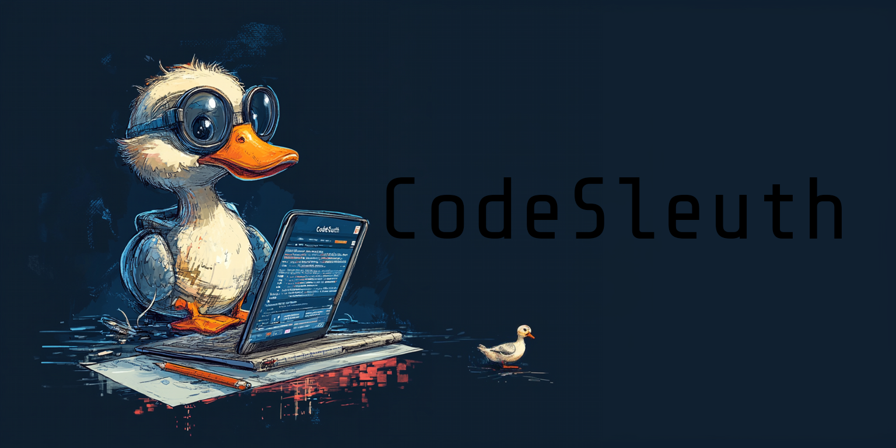

# CodeSleuth



[](/LICENSE) 

**code_sleuth.py** is an open-source tool for analyzing the architecture of a Python project, measuring the cyclomatic complexity of its code, detecting circular dependencies, and identifying overly large files. This script helps you maintain a clean codebase and improve your project's quality by providing useful metrics and recommendations.

---

## Features

- **File Size Analysis**: Identify large files in your project that exceed a specified line count.
- **Cyclomatic Complexity Analysis**: Evaluate the complexity of Python functions to pinpoint potential refactoring needs.
- **Dependency Analysis**: Analyze inter-file dependencies and detect circular dependencies to enhance maintainability.
- **Detailed Logging**: Provides real-time feedback during project analysis, including warnings for potential issues.
- **Modular Design**: Easily integrate and extend functionality by leveraging the modular structure.

---

## Installation

### Prerequisites

- Python 3.x
- Required Python libraries: `ast`, `radon`, `networkx`, `argparse`, `setuptools` and `graphviz` (for generating graphs if needed).

### Install dependencies

Clone this repository and install the required dependencies using pip.

```bash
git clone https://github.com/WiseGam/CodeSleuth.git
cd CodeSleuth
pip install -r requirements.txt
```

The requirements.txt file includes:

```bash
radon
networkx
graphviz
argparse
setuptools
```

If you don’t have graphviz installed, you might need to install it separately via your package manager or from Graphviz Downloads.

---

## Usage

### Running the Analysis

CodeSleuth can be run as a command-line tool to analyze Python projects or imported as a module for programmatic use.

#### Command-Line Usage

1. Analyze a Python project by specifying the directory path:

```bash
python -m codesleuth.analysis <directory_path>
```

2. Specify thresholds for large files and cyclomatic complexity (optional):

```bash
python -m codesleuth.analysis <directory_path> --max-lines 400 --complexity-low 4 --complexity-medium 8
```

3. Example:

```bash
python -m codesleuth.analysis my_python_project --max-lines 300
```

#### Programmatic Usage

You can integrate CodeSleuth's functionality into your own scripts by importing its modules.

1. Analyze Complexity:

```python
from codesleuth.complexity import analyze_complexity, generate_complexity_report

file_path = "my_python_project/example.py"
complexity_results = analyze_complexity(file_path)
thresholds = {'low': 5, 'medium': 10}
generate_complexity_report(file_path, complexity_results, thresholds)
```

2. Detect Large Files:

```python
from codesleuth.analysis import detect_large_files

large_files = detect_large_files("my_python_project", max_lines=500)
print("Large files:", large_files)
```

3. Dependency Analysis:

```python
from codesleuth.dependencies import analyze_dependencies, detect_circular_dependencies

graph = analyze_dependencies("my_python_project")
cycles = detect_circular_dependencies(graph)
if cycles:
    print("Circular dependencies detected:", cycles)
else:
    print("No circular dependencies.")
```

#### Output Example

Here’s an example of what you’ll see when running the analysis:

```bash
2025-01-01 20:54:15,367 - INFO - Starting project analysis for directory: my_python_project
Large files (over 500 lines):
  my_python_project/large_script.py (600 lines)

Cyclomatic complexity of functions:
  - calculate_sum: Complexity = 3 (Low Complexity - OK)
  - parse_data: Complexity = 12 (High Complexity - Needs refactoring)

Average cyclomatic complexity for the project: 7.50

Analyzing dependencies...
2025-01-01 20:54:15,407 - WARNING - Circular dependencies found: [['module_a.py', 'module_b.py']]
```

---

## Module Structure

CodeSleuth is modularized into submodules for better extensibility:

- `codesleuth.complexity`: Functions for analyzing cyclomatic complexity.
- `codesleuth.dependencies`: Tools for analyzing and detecting circular dependencies.
- `codesleuth.analysis`: Orchestrates the overall analysis.

---

## Logging

CodeSleuth uses Python’s built-in logging module to provide detailed output during analysis. Logging messages include:

- **INFO**: General progress messages.
- **WARNING**: Potential issues like large files or detected circular dependencies.
- **DEBUG**: Detailed output for developers.

### Example Log Output:

```bash
2025-01-01 20:54:15,368 - INFO - Detecting large files in directory: my_python_project
2025-01-01 20:54:15,370 - WARNING - Large file detected: my_python_project/large_file.py (600 lines)
2025-01-01 20:54:15,372 - INFO - Analyzing complexity for file: my_python_project/example.py
2025-01-01 20:54:15,383 - INFO - Detecting circular dependencies...
2025-01-01 20:54:15,384 - INFO - No circular dependencies detected.
```

---

## Testing

Unit tests are provided to ensure reliability and accuracy:

- Run tests using `unittest`:

```bash
python -m unittest discover -s tests
```

### Example test results:

```bash
2025-01-01 20:57:38,131 - INFO - Starting project analysis for directory: temp_test_dir
2025-01-01 20:57:38,131 - INFO - Detecting large files in directory: temp_test_dir
2025-01-01 20:57:38,132 - WARNING - Large file detected: temp_test_dir/large_file.py (600 lines)
Large files (over 500 lines):
temp_test_dir/large_file.py

Cyclomatic complexity of functions:
2025-01-01 20:57:38,133 - INFO - Analyzing complexity for file: temp_test_dir/module_a.py
2025-01-01 20:57:38,133 - INFO - Generating complexity report for file: temp_test_dir/module_a.py

Complexity report for temp_test_dir/module_a.py:
2025-01-01 20:57:38,133 - INFO - Analyzing complexity for file: temp_test_dir/simple_file.py
2025-01-01 20:57:38,134 - INFO - Generating complexity report for file: temp_test_dir/simple_file.py

Complexity report for temp_test_dir/simple_file.py:
  - test: Complexity = 1 (Low Complexity - OK)
2025-01-01 20:57:38,134 - INFO - Function test has complexity 1: Low Complexity - OK
2025-01-01 20:57:38,134 - INFO - Analyzing complexity for file: temp_test_dir/large_file.py
2025-01-01 20:57:38,142 - INFO - Generating complexity report for file: temp_test_dir/large_file.py

Complexity report for temp_test_dir/large_file.py:
2025-01-01 20:57:38,143 - INFO - Analyzing complexity for file: temp_test_dir/module_b.py
2025-01-01 20:57:38,143 - INFO - Generating complexity report for file: temp_test_dir/module_b.py

Complexity report for temp_test_dir/module_b.py:

Average cyclomatic complexity for the project: 1.00
2025-01-01 20:57:38,143 - INFO - Average cyclomatic complexity: 1.00

Analyzing dependencies...
2025-01-01 20:57:38,143 - INFO - Analyzing dependencies in directory: temp_test_dir
2025-01-01 20:57:38,155 - INFO - Detecting circular dependencies...
2025-01-01 20:57:38,157 - INFO - No circular dependencies detected.

No circular dependencies detected.
.2025-01-01 20:57:38,158 - INFO - Detecting large files in directory: temp_test_dir
2025-01-01 20:57:38,159 - WARNING - Large file detected: temp_test_dir/large_file.py (600 lines)
.2025-01-01 20:57:38,161 - INFO - Analyzing complexity for file: temp_test_file.py
.2025-01-01 20:57:38,166 - INFO - Generating complexity report for file: temp_test_file.py

Complexity report for temp_test_file.py:
  - simple_function: Complexity = 1 (Low Complexity - OK)
2025-01-01 20:57:38,166 - INFO - Function simple_function has complexity 1: Low Complexity - OK
.2025-01-01 20:57:38,169 - INFO - Analyzing dependencies in directory: temp_test_dir
.2025-01-01 20:57:38,179 - INFO - Detecting circular dependencies...
2025-01-01 20:57:38,179 - WARNING - Circular dependencies found: [['module_b.py', 'module_a.py']]
.
----------------------------------------------------------------------
Ran 6 tests in 0.049s

OK
```

---

## Extensibility

CodeSleuth can be extended by adding new modules or enhancing existing functionality. Here’s how to add a new analysis feature:

1. Create a new Python file in the `codesleuth` directory.
2. Define your analysis logic and integrate it into the `analysis.py` orchestrator.

---

## Contributing

Contributions are welcome! If you have ideas for improvements or fixes, feel free to open an issue or submit a pull request.
Steps to contribute:

- Fork this repository.
- Clone your fork locally.
- Create a branch for your feature (git checkout -b my-feature).
- Make your changes.
- Test your changes.
- Submit a pull request.

---

## License

This project is licensed under the MIT License.
